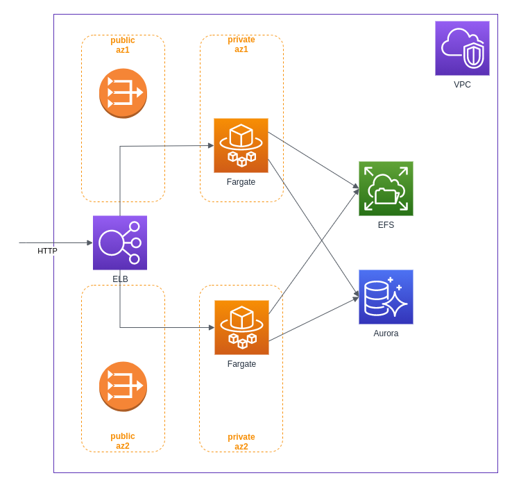

# _infrastructure-aws-wordpres_
Creating an infrastructure to host Wordpress on AWS that must be scalable and highly reliable using the Infrastructure as Code (IaC) approach. All the components that compose it are managed by AWS, the effort to configure and manage the application is minimal.

## Infrastructure consists of the following components:

- **VPC**
  *Amazon Virtual Private Cloud (Amazon VPC) is a service that lets you launch AWS resources in a logically isolated virtual network.*
- **Security-Group**
 *Security group acts as a virtual firewall for your instance to control inbound and outbound traffic.*
- **IAM**
  *The AWS Identity and Access Management system*
- **Application Elastic Load Balancer**
  *Elastic Load Balancing (Amazon ALB) automatically distributes incoming application.*
- **Elastic File System**
  *Amazon Elastic File System (Amazon EFS) offre un file system semplice, serverless, impostabile in maniera permanente ed elastico che consente di condividere i dati dei file senza occuparsi del provisioning o della gestione dello storage.*
- **Systems Manager Parameter Store**
  *Parameter Store, a capability of AWS Systems Manager, provides secure, hierarchical storage for configuration data management and secrets management.*
- **RDS Amazon Aurora**
  *Amazon Aurora is a MySQL compatible relational database built for the cloud, that combines the performance and availability of traditional enterprise databases with the simplicity and cost-effectiveness of open source databases.*
- **Cloudwatch**
  *The managed AWS Service to monitor the infrastructure components and automate some aspect (eg. Autoscaling) of them*
- **Elastic Container Service** 
  *Amazon Elastic Container Service (Amazon ECS) is a fully managed container orchestration service that helps you easily deploy, manage, and scale containerized applications.*

## Deployment method:
[***Terraform***](https://www.terraform.io/) is used to create infrastructure using the IaC allows developers to use a configuration language called HCL (HashiCorp Configuration Language) to describe the infrastructure using different [module Terraform](https://registry.terraform.io/browse/modules?provider=aws) battle tested to optimize the amount of code needed to provision the infrastructure. [***Terragrunt***](https://terragrunt.gruntwork.io/) was also used as a wrapper to add various functions.

In the Repository each single component is declared inside a dedicated folder which contains the files needed by terraform to create the resource. Using Terragrunt we can manage the dependencies between the various components and create all the necessary resources (S3 buckets and DynamoDB tables) to use a [remote state](https://www.terraform.io/docs/language/state/remote.html) for Terraform.

---
## Configure environment

### System requirements

- AWS IAM user credentials to access the account with sufficient permissions to create, update and destroy the AWS resources defined in this infrastructure. 
- [AWS CLI (v2)](https://docs.aws.amazon.com/cli/latest/userguide/install-cliv2.html)
- [Terraform](https://www.terraform.io/downloads.html) (1.0+)
- [Terragrunt](https://terragrunt.gruntwork.io/docs/getting-started/install/) (0.31+)

### secret:
The code contains the following sensitive input variables which must not be versioned in the repository. 
They can be entered manually before Terraform / Terragrunt is started or they can be passed to Terraform using a local .tfvars
|Name|Description|Type
|----|-----------|----
|usernamedb|The username of admin user of Aurora database|string|wordpress|
|passwordb|The password of admin user of Aurora database|string|eu-central-1|

### environment variables:
Several variables are used to parameterize the architecture. The variables are defined in varriable/common.sh

|Name|Description|Type|Default|
|----|-----------|----|-----------------------|
|project_name|The name of the project|string|wordpress|
|region|The AWS Region to create the infrastructure|string|eu-central-1|
|vpc_azs|A list of availability zones names or ids in the region|list of strings|["eu-central-1a", "eu-central-1b", "eu-central-1c"]|
|database_name|Name of the database hosted on the RDS instance|string|["eu-central-1a", "eu-central-1b","eu-central-1c"]|
|container_port|The container port on which expose the service|number|80
|container_name|The name of the container|string|wp-app
|vpc_01_vpc_cidr|The CIDR block of your VPC|string|13.0.0.0/16|
|vpc_01_public_subnets_value|The CIDR of public subnets|list of strings|["13.0.0.0/22","13.0.8.0/22","13.0.4.0/22"]|
|vpc_01_private_subnets_value|The CIDR of private subnets|list of strings|["13.0.32.0/21","13.0.40.0/21","13.0.48.0/21"]|
|vpc_01_database_subnets_value|The CIDR of private subnets|list of strings|["13.0.64.0/23","13.0.66.0/23","13.0.68.0/23"]|
|rds_01_family|The family of the DB parameter group|string|aurora-mysql5.7
|rds_01_engine|Aurora database engine type, currently aurora|string|aurora-mysql
|rds_01_replica_scale_enabled|Whether to enable autoscaling for RDS Aurora (MySQL) read replicas|bool|false
|rds_01_replica_count|Number of reader nodes to create|number|0
|rds_01_scaling_configuration_db_autopause|Enabled automatic pause Aurora DB cluster if idle|boolean|false
|rds_01_scaling_configuration_db_min_capacity|Minimum ACU (Aurora Capacity Unit) for Aurora Cluster|number|2
|rds_01_scaling_configuration_db_max_capacity|Maximum ACU (Aurora Capacity Unit) for Aurora Cluster|number|4
|rds_01_scaling_configuration_db_autopause_after_seconds|Amount of time (in seconds) with no activity before the Aurora DB cluster is paused|number|3600
|rds_01_timeout_action|The action to take when the timeout is reached|string|RollbackCapacityChange
|rds_01_deletion_protection|The DB instance should have deletion protection enabled|bool|true
|rds_01_storage_encrypted|Specifies whether the underlying storage layer should be encrypted|bool|true
|cloudwatch_log_group_01_log_retention_in_days|The default retention of Cloudwatch log groups used by some service|number|7
|task_definition_01_task_cpu|[The CPU size of each ECS task|number|1024|
|task_definition_01_task_memory|[The memory size of each ECS task|number|2048|
|task_definition_01_container_image_url|The Image to use in ECS tasks|string|wordpress:5.7.2-php7.3-apache|
|service_ecs_01_desired_count|[The initial desired number of tasks of ECS Service|number|2|
|appautoscaling_target_01_min_capacity|The minimum capacity of ECS Service Autoscaling|number|2|
|appautoscaling_target_01_max_capacit|The minimum capacity of ECS Service Autoscaling|number|10|
|appautoscaling_target_01_ecs_service_autoscaling_cpu_average_utilization_target|The average % of CPU utilization used in Target Tracking Scaling Policy of ECS Service|number|50|
|appautoscaling_target_01_ecs_service_autoscaling_scale_in_cooldown|Cooldown (in seconds) to scale in for ECS Service Autoscaling|number|500|
|appautoscaling_target_01_ecs_service_autoscaling_scale_out_cooldown|Cooldown (in seconds) to scale out for ECS Service Autoscaling|number|500|

### Authentication
Set up an AWS CLI profile, it will be used by Terraform to authenticate with your AWS account
An example of configuring a profile
```
$ aws configure --profile simoneferraro
AWS Access Key ID [None]: ***
AWS Secret Access Key [None]: ***
Default region name [None]: eu-central-1
Default output format [None]: json
```
Export the AWS_PROFILE environment variable, enhancing it with the profile name
```
$ export AWS_PROFILE=simoneferraro
```
