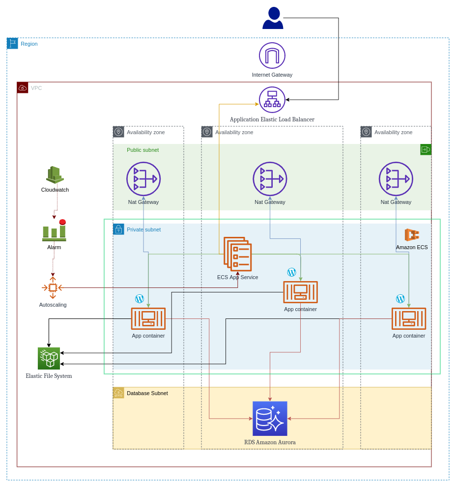

# _infrastructure-aws-wordpres_
Creating an infrastructure to host Wordpress on AWS that must be scalable and highly reliable using the Infrastructure as Code (IaC) approach. All the components that compose it are managed by AWS, the effort to configure and manage the application is minimal.

## Infrastructure consists of the following components:

- **VPC**
  *Amazon Virtual Private Cloud (Amazon VPC) is a service that lets you launch AWS resources in a logically isolated virtual network.*
- **Security-Group**
 *Security group acts as a virtual firewall for your instance to control inbound and outbound traffic.*
- **IAM**
  *The AWS Identity and Access Management system*
- **Application Elastic Load Balancer**
  *Elastic Load Balancing (Amazon ALB) automatically distributes incoming application.*
- **Elastic File System**
  *Amazon Elastic File System (Amazon EFS) offre un file system semplice, serverless, impostabile in maniera permanente ed elastico che consente di condividere i dati dei file senza occuparsi del provisioning o della gestione dello storage.*
- **Systems Manager Parameter Store**
  *Parameter Store, a capability of AWS Systems Manager, provides secure, hierarchical storage for configuration data management and secrets management.*
- **RDS Amazon Aurora**
  *Amazon Aurora is a MySQL compatible relational database built for the cloud, that combines the performance and availability of traditional enterprise databases with the simplicity and cost-effectiveness of open source databases.*
- **Cloudwatch**
  *The managed AWS Service to monitor the infrastructure components and automate some aspect (eg. Autoscaling) of them*
- **Elastic Container Service** 
  *Amazon Elastic Container Service (Amazon ECS) is a fully managed container orchestration service that helps you easily deploy, manage, and scale containerized applications.*

### Deployment method:
[***Terraform***](https://www.terraform.io/) is used to create infrastructure using the IaC allows developers to use a configuration language called HCL (HashiCorp Configuration Language) to describe the infrastructure using different [module Terraform](https://registry.terraform.io/browse/modules?provider=aws) battle tested to optimize the amount of code needed to provision the infrastructure. [***Terragrunt***](https://terragrunt.gruntwork.io/) was also used as a wrapper to add various functions.

In the Repository each single component is declared inside a dedicated folder which contains the files needed by terraform to create the resource. Using Terragrunt we can manage the dependencies between the various components and create all the necessary resources (S3 buckets and DynamoDB tables) to use a [remote state](https://www.terraform.io/docs/language/state/remote.html) for Terraform.

### Configure environment
Several variables are used to parameterize the architecture. The variables are defined in variables/common.sh
